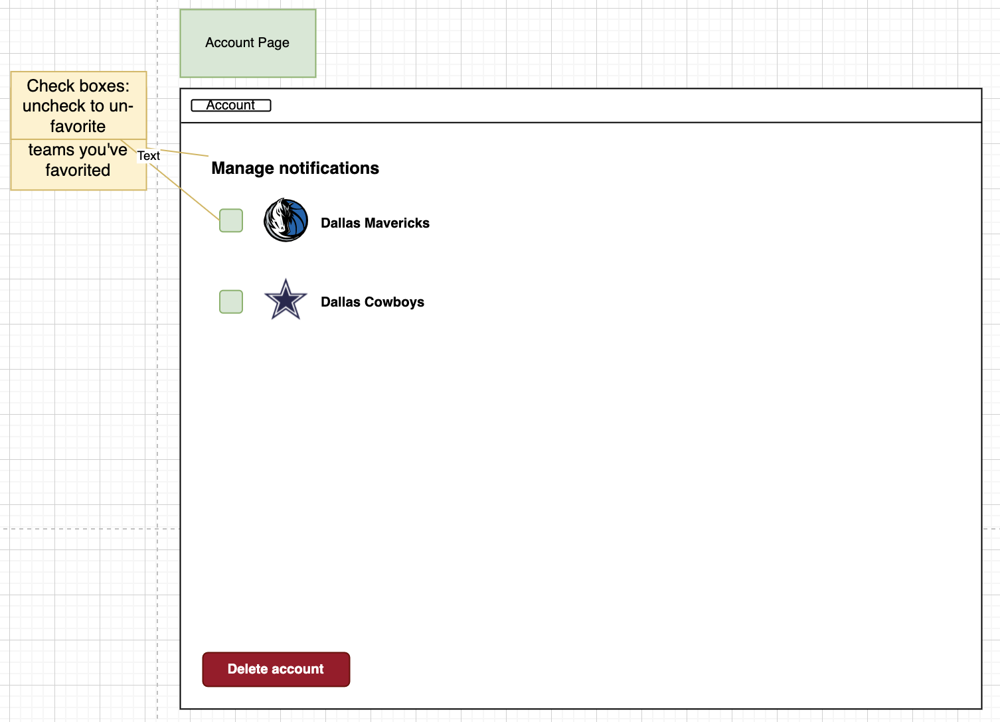
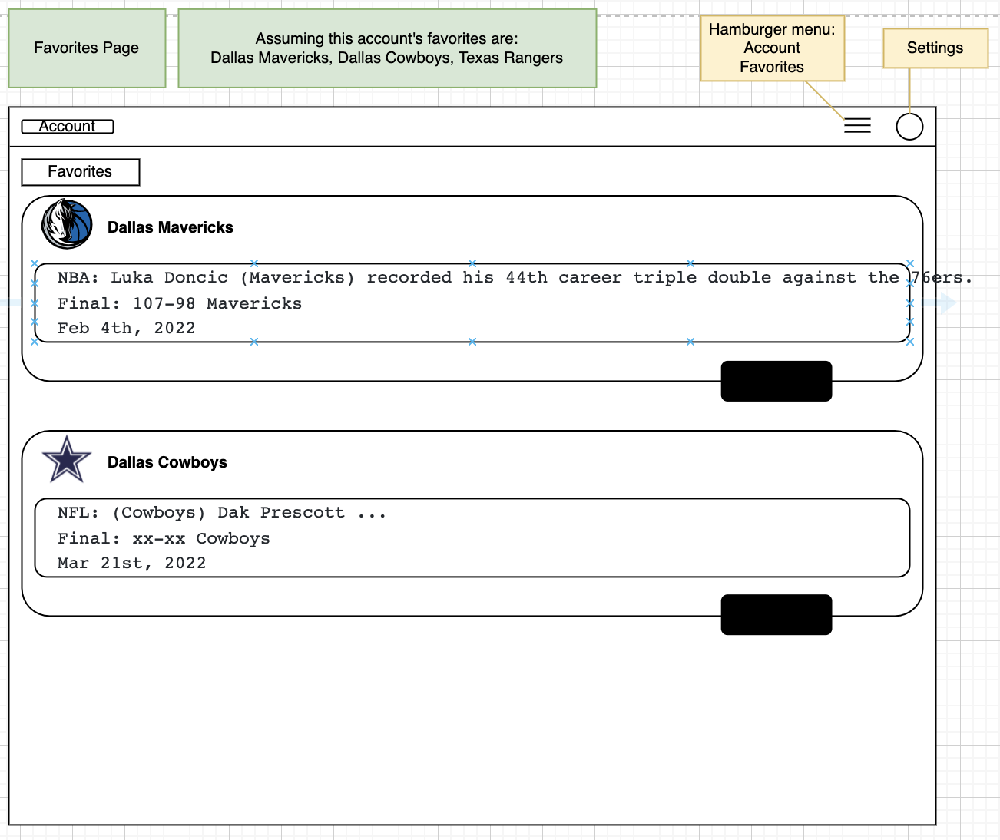
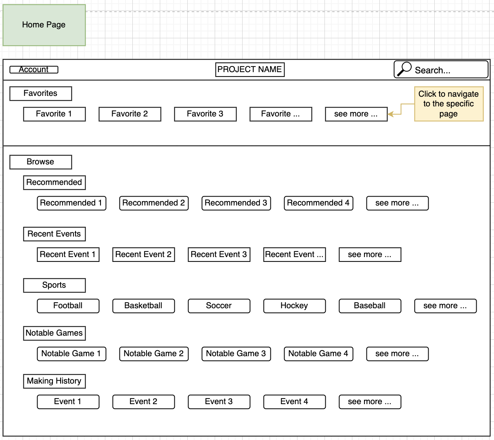
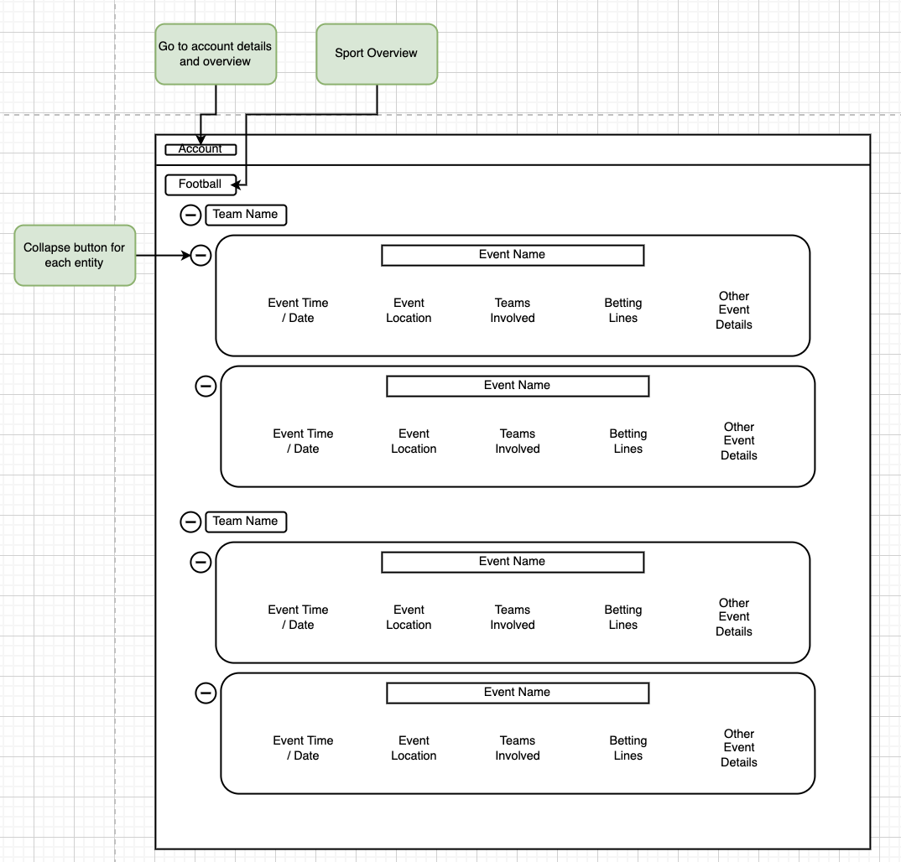
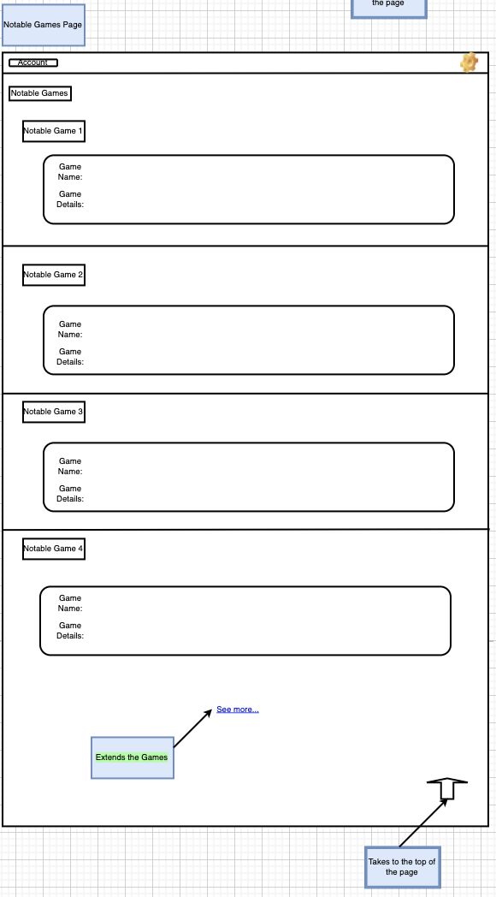
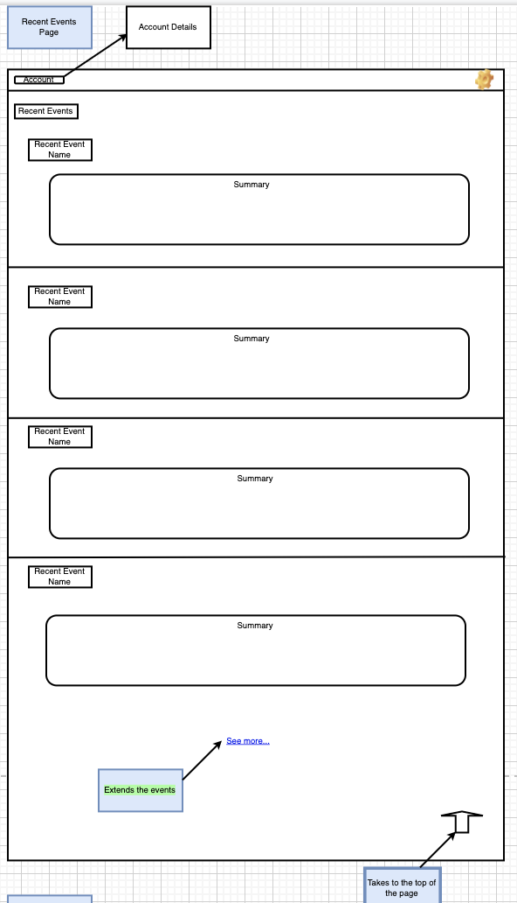

# MLSN (Major League Sports Notifications)
  
This project is designed for users to have easy access to notable sporting events as soon as they happen. A user can tailor their notifications to the sports/players of their choice. Some options for tailored categories will be: NFL, NBA, MLB, NHL, MLS, Olympics etc.
 
 
 

<!-- TABLE OF CONTENTS -->

  
Table of Contents

  <ol>
    <li>
      <a href="#about-the-project">About The Project</a>
    </li>
    <li>
      <a href="#getting-started">Getting Started</a>
    </li>
    <li><a href="#license">License</a></li>
    <li><a href="#contact">Contact</a></li>
  </ol>

 

<!-- ABOUT THE PROJECT -->
## About The Project

Scrum Master: Justin Workman

Below you can find various wireframes that were created during the brainstorming phase. While we did not end up implementing a majority of these pages, we still would like to someday implement them. 

Account Page Wireframe:

Favorites Page Wireframe:

Home Page Wireframe: 

Individual Sports Page Wireframe:

Notable Games Page Wireframe:  

Recent Events Page Wireframe:  

 
 
 

<!-- GETTING STARTED -->
## Getting Started

### Installation

The web application can currently be reached at the EC2 instance right now at:

[http://44.203.24.239:8080/](http://44.203.24.239:8080/)

 

If the application server happens to go down, follow these steps to run the application locally from your own machine:

* Clone the repository locally to your machine.
* Run the main.py file to launch the local development server and follow the local IP address that you’re prompted with.
* Interact with the application and enjoy!

  

(<a href="#top">back to top</a>)

<!-- LICENSE -->
## License

Distributed under the MIT License. See `LICENSE.txt` for more information.

(<a href="#top">back to top</a>)

<!-- CONTACT -->
## Contact

Justin Workman - workma3@clemson.edu 

Reagan Hay - reaganjhay@gmail.com

Casey O'Reilly - ceoreil@g.clemson.edu

Sai Krishna - saikrim@clemson.edu

 

Project Link: [https://github.com/rhay-repo/notifications-for-sporting-events](https://github.com/rhay-repo/notifications-for-sporting-events)

(<a href="#top">back to top</a>)

